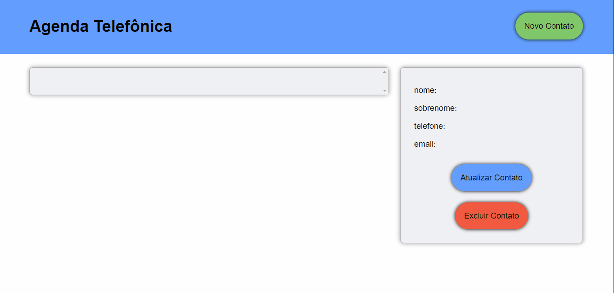

<h1 align="center">Agenda Telefonica</h1>

<p align="center">Aplicação Web em React Js de gerenciamento de contatos.</p>
<p align="center" style="text-align: center;">Usando postgres e nodeJs na base de dados.</p>

<p align="center"> 
  <a aria-label="React Version" href="https://github.com/facebook/react-native">
    </img>
  </a>
</p>

Para iniciar o frontend desta aplicação, na raiz do projeto de os segintes comandos:

```bash
cd frontend
yarn
yarn start
```

Após o carregamento, o React abrirá a aplicação em seu navegadro padrão na pagina  `localhost:3000`



Demonstração do comportamento do banco de dados da aplicação:


